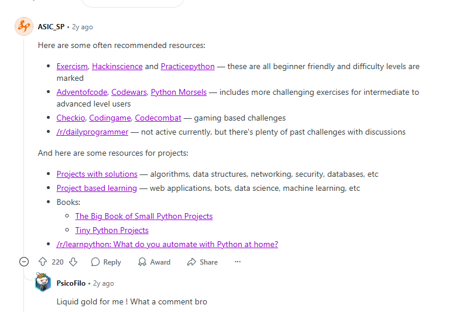

# pythone

- https://www.reddit.com/r/learnpython/comments/zb92nc/good_python_exercises/

Here are some often recommended resources:

- Exercism - https://exercism.org/tracks/python/exercises
- Hackinscience - https://genepy.org/exercises/
- Practicepython- https://www.practicepython.org/
these are all beginner friendly and difficulty levels are marked

- Adventofcode- https://adventofcode.com/
- Codewars- https://www.codewars.com/
- Python Morsels - https://www.pythonmorsels.com/

includes more challenging exercises for intermediate to advanced level users

- Checkio- https://py.checkio.org/
- Codingame - https://www.codingame.com/start/
- Codecombat - https://codecombat.com/

gaming based challenges

/r/dailyprogrammer- https://www.reddit.com/r/dailyprogrammer/
— not active currently, but there's plenty of past challenges with discussions

And here are some resources for projects:

Projects with solutions- https://github.com/karan/Projects-Solutions
— algorithms, data structures, networking, security, databases, etc

Project based learning - https://github.com/practical-tutorials/project-based-learning#python
— web applications, bots, data science, machine learning, etc

Books:

The Big Book of Small Python Projects- https://inventwithpython.com/bigbookpython/

Tiny Python Projects - https://www.manning.com/books/tiny-python-projects

/r/learnpython: What do you automate with Python at home?- https://www.reddit.com/r/learnpython/comments/k5k1h0/what_do_you_automate_with_python_at_home/
